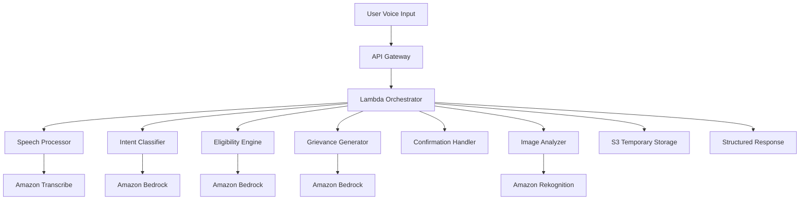

# Design Document: Voice-First Civic Assistant

## Overview

The Voice-First Civic Assistant is a serverless, AI-powered system built on AWS that enables citizens to access government health services through natural voice interaction. The system uses a microservices architecture with Amazon Bedrock for AI reasoning, Amazon Transcribe for speech processing, and Amazon Rekognition for image analysis.

The core workflow involves:

1. Voice input processing and intent classification
2. Context-aware conversation management
3. AI-powered eligibility assessment or grievance generation
4. Human-in-the-loop document confirmation
5. Structured output generation

The system is designed for scalability, security, and multilingual support while maintaining explainable AI decisions and responsible data handling.

## Architecture

### High-Level Architecture



### Component Architecture

The system follows a serverless microservices pattern with the following key components:

**API Layer:**

- Amazon API Gateway for HTTP/WebSocket endpoints
- AWS Lambda for serverless compute
- Amazon CloudFront for global content delivery

**AI Services Layer:**

- Amazon Bedrock (Claude/Titan models) for natural language understanding and generation
- Amazon Transcribe for speech-to-text conversion
- Amazon Rekognition for document image analysis

**Data Layer:**

- Amazon S3 for temporary document storage
- Amazon DynamoDB for session state management
- AWS Systems Manager Parameter Store for configuration

**Security Layer:**

- AWS IAM for access control
- AWS KMS for encryption
- Amazon CloudWatch for monitoring and logging

## Components and Interfaces

### Speech Processor

**Purpose:** Converts voice input to text and manages audio processing.

**Interface:**

```typescript
interface SpeechProcessor {
  processAudio(
    audioData: Buffer,
    language: Language,
  ): Promise<TranscriptionResult>;
  detectLanguage(audioData: Buffer): Promise<Language>;
  validateAudioQuality(audioData: Buffer): Promise<AudioQuality>;
}

interface TranscriptionResult {
  text: string;
  confidence: number;
  language: Language;
  timestamp: Date;
}
```

**Implementation:** Uses Amazon Transcribe with custom vocabulary for government terminology and regional language support.

### Intent Classifier

**Purpose:** Determines user intent (scheme eligibility vs grievance filing) from natural language input.

**Interface:**

```typescript
interface IntentClassifier {
  classifyIntent(
    text: string,
    context: ConversationContext,
  ): Promise<IntentResult>;
  askClarification(ambiguousInput: string): Promise<ClarificationQuestion>;
}

interface IntentResult {
  intent: "eligibility" | "grievance" | "unclear";
  confidence: number;
  entities: ExtractedEntity[];
  reasoning: string;
}
```

**Implementation:** Uses Amazon Bedrock with few-shot prompting and conversation context to classify user intents accurately.

### Eligibility Engine

**Purpose:** Evaluates PM-JAY eligibility based on household information and official criteria.

**Interface:**

```typescript
interface EligibilityEngine {
  assessEligibility(householdInfo: HouseholdInfo): Promise<EligibilityResult>;
  generateQuestions(
    incompleteInfo: Partial<HouseholdInfo>,
  ): Promise<Question[]>;
  explainDecision(result: EligibilityResult): Promise<Explanation>;
}

interface EligibilityResult {
  eligible: boolean;
  reasoning: string[];
  missingCriteria?: string[];
  qualifyingFactors?: string[];
  confidenceScore: number;
}
```

**Implementation:** Uses rule-based logic combined with Amazon Bedrock for complex household composition analysis and explanation generation.

### Grievance Generator

**Purpose:** Converts unstructured complaints into formal grievance documents.

**Interface:**

```typescript
interface GrievanceGenerator {
  generateGrievance(
    complaint: UserComplaint,
    evidence?: ImageEvidence[],
  ): Promise<GrievanceDocument>;
  categorizeComplaint(description: string): Promise<ComplaintCategory>;
  suggestEvidence(category: ComplaintCategory): Promise<EvidenceRequirement[]>;
}

interface GrievanceDocument {
  title: string;
  description: string;
  category: ComplaintCategory;
  legalReferences: string[];
  evidence: Evidence[];
  recommendedAction: string;
}
```

**Implementation:** Uses Amazon Bedrock with structured prompting and legal/policy knowledge base integration.

### Image Analyzer

**Purpose:** Extracts information from uploaded documents and images.

**Interface:**

```typescript
interface ImageAnalyzer {
  analyzeDocument(
    imageData: Buffer,
    documentType: DocumentType,
  ): Promise<ExtractedInfo>;
  validateDocumentQuality(imageData: Buffer): Promise<QualityAssessment>;
  extractKeyValuePairs(imageData: Buffer): Promise<KeyValuePair[]>;
}

interface ExtractedInfo {
  text: string;
  keyFields: Record<string, string>;
  documentType: DocumentType;
  confidence: number;
}
```

**Implementation:** Uses Amazon Rekognition for OCR and Amazon Bedrock for intelligent information extraction and validation.

### Document Generator

**Purpose:** Creates structured application drafts and grievance forms.

**Interface:**

```typescript
interface DocumentGenerator {
  generateApplication(
    eligibilityResult: EligibilityResult,
    userInfo: UserInfo,
  ): Promise<ApplicationDraft>;
  generateGrievanceForm(
    grievance: GrievanceDocument,
    userInfo: UserInfo,
  ): Promise<GrievanceForm>;
  formatForSubmission(
    document: Document,
    format: OutputFormat,
  ): Promise<FormattedDocument>;
}

interface ApplicationDraft {
  formFields: Record<string, string>;
  requiredDocuments: string[];
  submissionInstructions: string;
  incompleteFields: string[];
}
```

**Implementation:** Template-based generation with dynamic field population and validation.

### Confirmation Handler

**Purpose:** Manages human-in-the-loop confirmation workflow.

**Interface:**

```typescript
interface ConfirmationHandler {
  presentForReview(document: Document): Promise<ReviewSession>;
  processUserFeedback(
    sessionId: string,
    feedback: UserFeedback,
  ): Promise<UpdatedDocument>;
  finalizeDocument(
    sessionId: string,
    approved: boolean,
  ): Promise<FinalDocument>;
}

interface ReviewSession {
  sessionId: string;
  document: Document;
  highlightedFields: string[];
  suggestedChanges: string[];
}
```

**Implementation:** Interactive review process with change tracking and iterative refinement.

## Data Models

### Core Data Types

```typescript
// User and Session Management
interface UserSession {
  sessionId: string;
  userId?: string;
  language: Language;
  conversationHistory: ConversationTurn[];
  currentIntent: Intent;
  createdAt: Date;
  expiresAt: Date;
}

interface ConversationTurn {
  timestamp: Date;
  userInput: string;
  systemResponse: string;
  intent: Intent;
  entities: ExtractedEntity[];
}

// Household and Eligibility
interface HouseholdInfo {
  headOfHousehold: PersonInfo;
  members: PersonInfo[];
  address: Address;
  economicStatus: EconomicIndicators;
  existingSchemes: string[];
}

interface PersonInfo {
  name: string;
  age: number;
  gender: Gender;
  relation: FamilyRelation;
  occupation?: string;
  disabilities?: Disability[];
  chronicConditions?: MedicalCondition[];
}

interface EconomicIndicators {
  incomeCategory: IncomeCategory;
  rationCardType?: RationCardType;
  landOwnership?: LandOwnership;
  housingType: HousingType;
  assets: Asset[];
}

// Grievance and Complaint
interface UserComplaint {
  description: string;
  incidentDate: Date;
  location: string;
  involvedParties: string[];
  category: ComplaintCategory;
  severity: SeverityLevel;
  evidence: Evidence[];
}

interface Evidence {
  type: EvidenceType;
  description: string;
  imageData?: Buffer;
  extractedInfo?: ExtractedInfo;
}

// Document Generation
interface Document {
  id: string;
  type: DocumentType;
  title: string;
  content: DocumentContent;
  metadata: DocumentMetadata;
  status: DocumentStatus;
}

interface DocumentContent {
  sections: DocumentSection[];
  formFields: Record<string, FormField>;
  attachments: Attachment[];
}

// Enums and Constants
enum Language {
  HINDI = "hi",
  ENGLISH = "en",
}

enum Intent {
  ELIGIBILITY_CHECK = "eligibility",
  GRIEVANCE_FILING = "grievance",
  GENERAL_INQUIRY = "inquiry",
}

enum ComplaintCategory {
  HOSPITAL_OVERCHARGING = "overcharging",
  BENEFIT_DENIAL = "benefit_denial",
  SERVICE_QUALITY = "service_quality",
  DISCRIMINATION = "discrimination",
}

enum DocumentType {
  PM_JAY_APPLICATION = "pmjay_application",
  HEALTH_GRIEVANCE = "health_grievance",
  SUPPORTING_DOCUMENT = "supporting_doc",
}
```

### Data Flow and State Management

The system maintains conversation state through DynamoDB sessions with the following lifecycle:

1. **Session Creation:** New session created on first user interaction
2. **Context Accumulation:** Each conversation turn adds to context
3. **Intent Persistence:** Intent classification persists across turns
4. **Document Building:** Information accumulates toward document generation
5. **Confirmation Cycle:** Review and refinement iterations
6. **Session Cleanup:** Automatic cleanup after 24 hours or completion

### Data Validation and Constraints

- All personal information encrypted at rest and in transit
- Session data automatically expires after 24 hours
- Document drafts require explicit user confirmation before finalization
- Image uploads limited to 10MB and common formats (JPEG, PNG, PDF)
- Voice input limited to 2 minutes per turn to ensure responsiveness

## Correctness Properties

_A property is a characteristic or behavior that should hold true across all valid executions of a system—essentially, a formal statement about what the system should do. Properties serve as the bridge between human-readable specifications and machine-verifiable correctness guarantees._

### Property 1: Speech Processing Accuracy

_For any_ audio input in Hindi or English with acceptable quality, the Speech_Processor should produce text transcription with accuracy appropriate for the detected language and handle regional accents consistently.
**Validates: Requirements 1.1, 1.3**

### Property 2: Speech Processing Performance

_For any_ voice input under 2 minutes, the Speech_Processor should complete processing within 5 seconds and maintain conversation context across multiple interactions.
**Validates: Requirements 1.4, 1.5**

### Property 3: Error Handling and Recovery

_For any_ poor quality audio, unclear images, or system errors, the Voice_Assistant should provide clear error messages and appropriate recovery options (repeat input, clearer image, etc.).
**Validates: Requirements 1.2, 6.3, 10.3**

### Property 4: Intent Classification Accuracy

_For any_ clear user statement describing their needs, the Intent_Classifier should correctly identify whether they want PM-JAY eligibility checking or grievance filing with at least 90% accuracy.
**Validates: Requirements 2.1, 2.4**

### Property 5: Intent Ambiguity Handling

_For any_ ambiguous user input or intent switching during conversation, the Intent_Classifier should ask appropriate clarifying questions and adapt the workflow accordingly.
**Validates: Requirements 2.2, 2.3**

### Property 6: Eligibility Assessment Correctness

_For any_ complete household information, the Eligibility_Engine should evaluate PM-JAY eligibility according to official criteria and handle complex household compositions including joint families and dependents.
**Validates: Requirements 3.1, 3.5**

### Property 7: Eligibility Information Gathering

_For any_ incomplete household information, the Eligibility_Engine should ask specific follow-up questions to gather necessary details for accurate assessment.
**Validates: Requirements 3.3**

### Property 8: Document Generation Completeness

_For any_ eligible user or valid grievance, the Document_Generator should create structured documents that include all required fields based on provided information and clearly mark any incomplete sections.
**Validates: Requirements 4.1, 4.2, 4.3, 5.1**

### Property 9: Document Format Compliance

_For any_ generated PM-JAY application or health grievance, the Document_Generator should format the output according to official form requirements and submission standards.
**Validates: Requirements 4.4, 5.5**

### Property 10: Grievance Legal References

_For any_ hospital overcharging complaint, the Grievance_Generator should include relevant legal and policy references, and for benefit denial complaints, should reference applicable PM-JAY guidelines.
**Validates: Requirements 5.2, 5.3**

### Property 11: Information Gathering for Grievances

_For any_ insufficient grievance details, the Grievance_Generator should ask targeted questions to gather necessary information for complete complaint documentation.
**Validates: Requirements 5.4**

### Property 12: Image Analysis and Extraction

_For any_ uploaded document image with acceptable quality, the Image_Analyzer should extract relevant text and information, identify key details from medical bills/receipts, and integrate findings with voice input.
**Validates: Requirements 6.1, 6.2, 6.4**

### Property 13: Document Type Recognition

_For any_ common document type (bills, prescriptions, identity documents), the Image_Analyzer should properly recognize and process the document according to its type.
**Validates: Requirements 6.5**

### Property 14: Language Consistency

_For any_ user interaction in Hindi or English, the Voice_Assistant should maintain the same language throughout the conversation, adapt to mixed-language input, and generate documents in the user's chosen language with culturally appropriate terminology.
**Validates: Requirements 7.1, 7.2, 7.3, 7.4, 7.5**

### Property 15: Human-in-the-Loop Confirmation

_For any_ generated document, the Confirmation_Handler should present it for user review with highlighted key information, allow modifications, incorporate user feedback, and never auto-submit without explicit approval.
**Validates: Requirements 8.1, 8.2, 8.3, 8.4, 8.5**

### Property 16: Document Finalization

_For any_ user-confirmed document, the Confirmation_Handler should mark it as final and ready for submission only after explicit user approval.
**Validates: Requirements 4.5, 8.4**

### Property 17: Data Security and Encryption

_For any_ personal information processed by the Voice_Assistant, the system should encrypt data in transit and at rest, use secure storage mechanisms, and never share information with unauthorized parties.
**Validates: Requirements 9.1, 9.3, 9.4**

### Property 18: Data Retention and Deletion

_For any_ completed conversation or user deletion request, the Voice_Assistant should delete personal data within 24 hours of conversation end or immediately upon user request.
**Validates: Requirements 9.2, 9.5**

### Property 19: Performance Requirements

_For any_ simple voice query, the Voice_Assistant should respond within 5 seconds, and for document generation tasks, should complete processing within 30 seconds.
**Validates: Requirements 10.1, 10.2**

### Property 20: Explainable Eligibility Decisions

_For any_ PM-JAY eligibility determination, the Eligibility_Engine should provide step-by-step reasoning, explain unmet criteria for denials, and highlight qualifying factors for approvals.
**Validates: Requirements 3.2, 11.1, 11.2, 11.3**

### Property 21: Explainable Grievance Generation

_For any_ generated grievance document, the Grievance_Generator should explain how user input was structured into formal complaints using simple, understandable language appropriate to the user's literacy level.
**Validates: Requirements 11.4, 11.5**

## Error Handling

The system implements comprehensive error handling across all components:

### Speech Processing Errors

- **Audio Quality Issues:** Request clearer audio input with specific guidance
- **Language Detection Failures:** Prompt user to specify language preference
- **Transcription Confidence Low:** Ask for confirmation or repetition
- **Timeout Errors:** Graceful degradation with retry options

### AI Service Errors

- **Bedrock API Failures:** Fallback to cached responses or simplified processing
- **Rate Limiting:** Queue management with user notification
- **Model Unavailability:** Graceful degradation to rule-based processing
- **Context Length Exceeded:** Intelligent context summarization

### Data Processing Errors

- **Image Analysis Failures:** Request manual input as fallback
- **Document Generation Errors:** Provide partial documents with clear missing sections
- **Validation Failures:** Clear error messages with correction guidance
- **Storage Errors:** Retry mechanisms with user notification

### User Experience Errors

- **Session Timeout:** Graceful session recovery with context preservation
- **Network Connectivity:** Offline capability for critical functions
- **Input Validation:** Real-time feedback with correction suggestions
- **Confirmation Errors:** Multiple review cycles with clear change tracking

## Testing Strategy

The Voice-First Civic Assistant requires a comprehensive testing approach combining unit tests for specific scenarios and property-based tests for universal correctness guarantees.

### Property-Based Testing

**Framework:** We will use Hypothesis (Python) for property-based testing, configured to run a minimum of 100 iterations per property test to ensure comprehensive input coverage.

**Test Configuration:**

- Each property test will be tagged with: **Feature: voice-civic-assistant, Property {number}: {property_text}**
- Tests will generate random but realistic data including household compositions, complaint descriptions, audio samples, and document images
- Edge cases will be explicitly included in generators (empty inputs, boundary conditions, malformed data)

**Key Property Test Areas:**

- Speech processing accuracy across languages and accents
- Intent classification with various input styles and ambiguity levels
- Eligibility assessment with complex household scenarios
- Document generation with incomplete and complete information
- Language consistency across conversation flows
- Error handling with various failure modes

### Unit Testing

**Complementary Coverage:**
Unit tests will focus on specific examples, integration points, and edge cases that demonstrate correct behavior:

- **Integration Testing:** API Gateway → Lambda → AI Services workflows
- **Edge Case Testing:** Boundary conditions for eligibility rules, maximum input lengths, timeout scenarios
- **Error Condition Testing:** Specific failure modes, malformed inputs, service unavailability
- **Performance Testing:** Response time validation for critical user journeys
- **Security Testing:** Data encryption, access control, and privacy compliance

**Test Data Management:**

- Synthetic test data for household scenarios and complaint examples
- Anonymized real-world data samples for speech and image testing
- Multilingual test cases covering Hindi and English variations
- Document templates for format compliance validation

### Testing Infrastructure

**Continuous Integration:**

- Automated test execution on every code change
- Property test results tracked for regression detection
- Performance benchmarks monitored for degradation
- Security scans integrated into pipeline

**Test Environment:**

- Isolated AWS environment mirroring production
- Mock AI services for deterministic testing
- Test data cleanup automation for privacy compliance
- Monitoring and alerting for test failures

The dual testing approach ensures both correctness (property tests verify universal rules) and reliability (unit tests catch specific bugs and integration issues), providing comprehensive coverage for this AI-powered civic assistance system.
